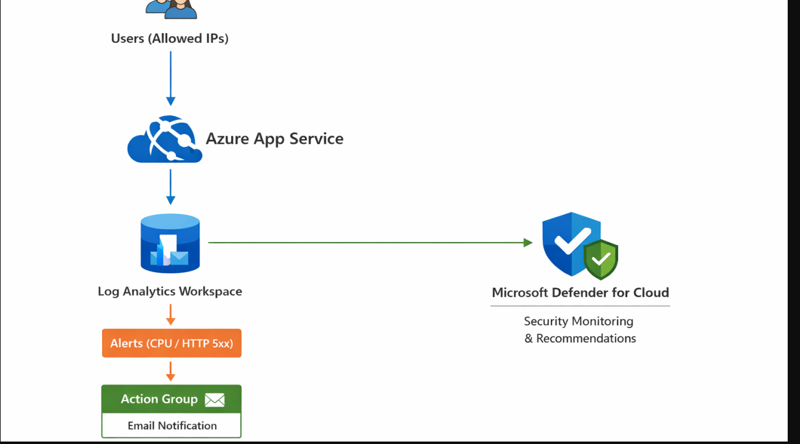
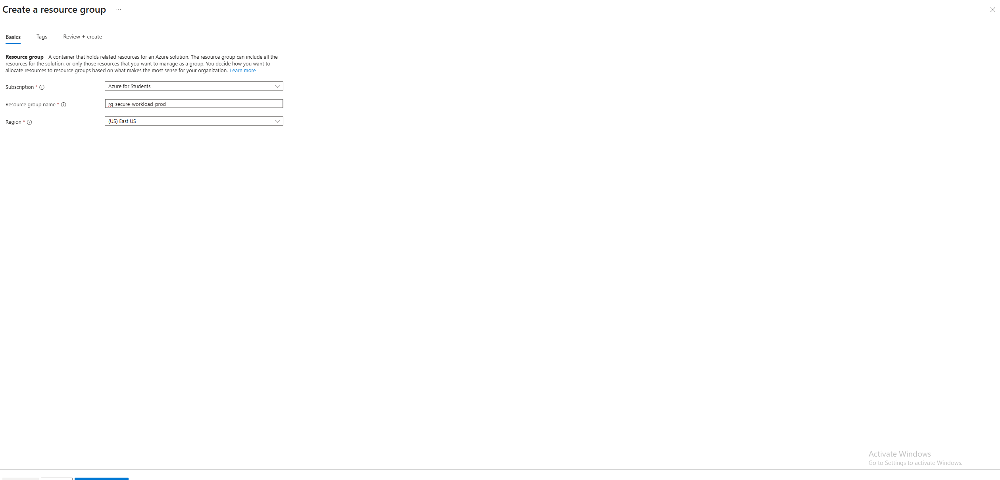
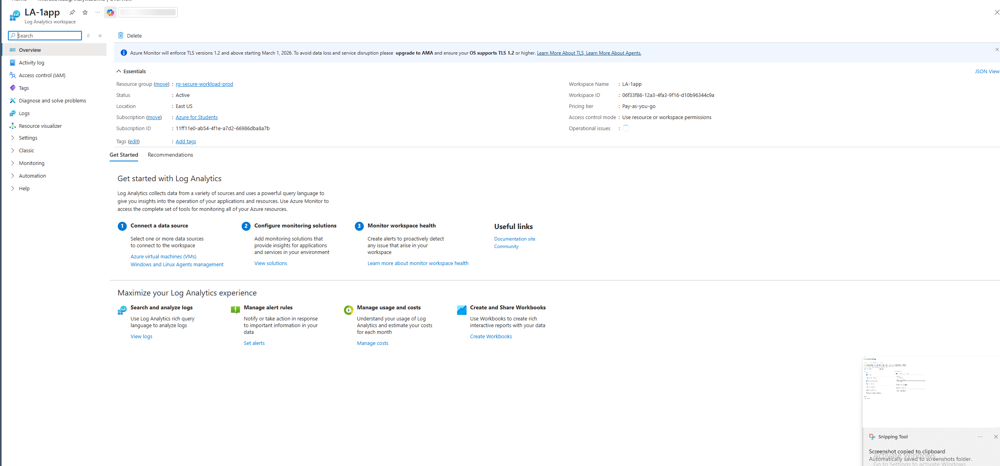

# Azure App Service Monitoring & Security Lab

## Overview
This project demonstrates deploying a real Azure App Service workload and configuring
enterprise-style monitoring, alerting, and security.

The focus of this lab is cloud operations, visibility, and security—not application development.

- Users with allowed IPs can access the app  
- Logs and metrics are centralized in **Log Analytics**  
- Alerts notify the team via **Action Groups**  
- **Defender for Cloud** monitors security posture  

---

## Implementation Details
  
*High-level workflow diagram showing users accessing the App Service, logs flowing into Log Analytics, metrics triggering alerts, and security monitoring via Defender for Cloud.*
### 1. Resource Group Creation
  
Created a dedicated **resource group** to contain all resources for this lab, providing isolation and easy management of Azure assets.

### 2. App Service Deployment
  
Deployed an **Azure App Service** with a default web app. This simulates a real workload hosted in Azure, ready to receive traffic.

### 3. App Running
  
Verified the application is running via the default Azure App Service URL. This confirms deployment success.

### 4. IP Access Restrictions
  
Configured **network access rules** to limit which IPs can reach the app, reducing attack surface and demonstrating secure deployment practices.

### 5. Diagnostic Settings
  
Set up **diagnostic settings** to send **application and HTTP logs** to the Log Analytics Workspace for monitoring and analysis.

### 6. Log Analytics Workspace
  
Centralized logs for query and analysis. This enables operational visibility and troubleshooting of application behavior in real time.

### 7. Action Group
  
Configured an **Action Group** to notify stakeholders via email when alerts trigger, simulating an operational incident response workflow.

### 8. Alert Rule – Action Group
  
Linked a **CPU utilization alert** to the Action Group. This ensures the team is notified when resource usage exceeds thresholds.

### 9. CPU Alert Rule
  
Defined thresholds for **CPU percentage** to proactively monitor application performance and respond to potential overloads.

### 10. HTTP Logs
  
Captured **incoming HTTP requests** to monitor traffic patterns, detect anomalies, and validate access restrictions.

---

## Security Posture

- Enabled **Microsoft Defender for Cloud** to monitor the app’s security posture  
- Applied **IP-based access restrictions** to reduce exposure  
- Monitored recommendations for best-practice security compliance  

---

## Next Steps

1. Convert the deployment to **Infrastructure as Code (Terraform)**  
2. Implement **CI/CD** using GitHub Actions for automated deployments  
3. Add **authentication with Microsoft Entra ID** to secure the application  

